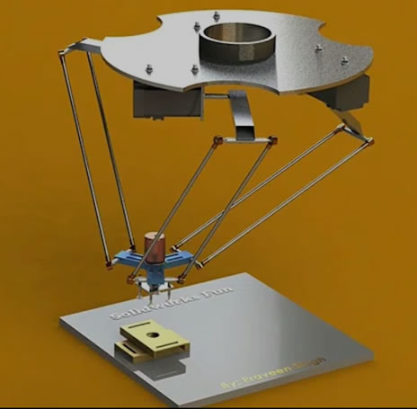
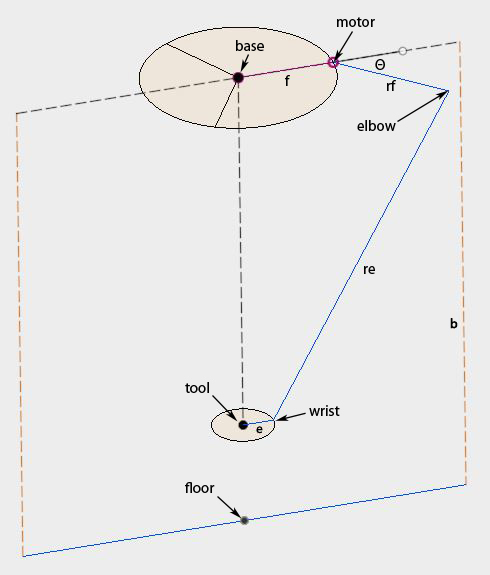
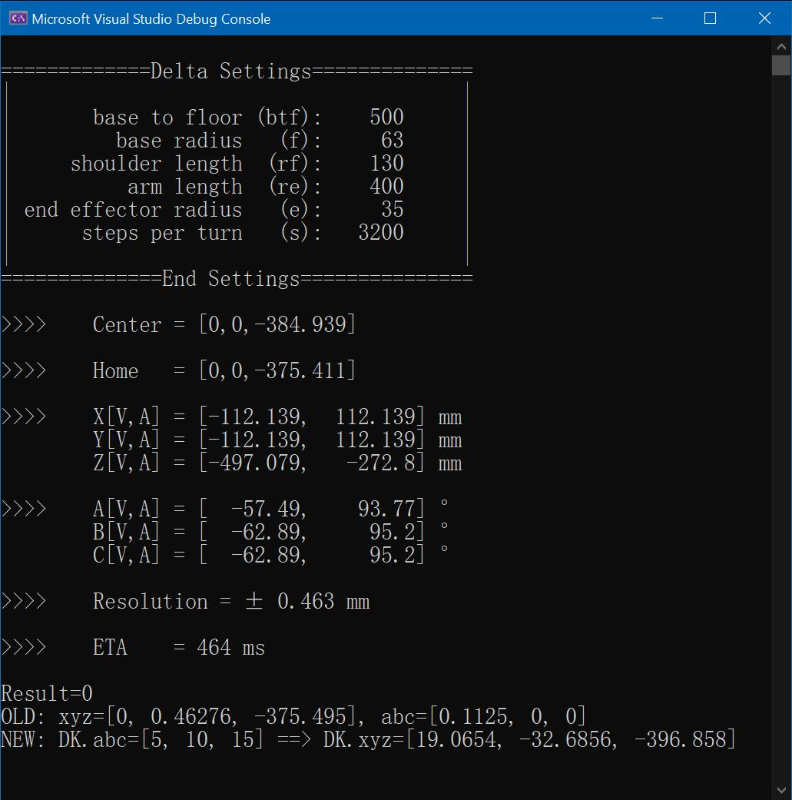
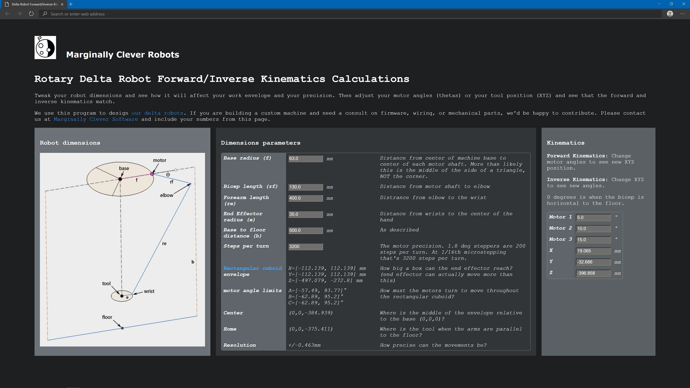

<table>
	<tr>
		<td></td>
		<td></td>
	</tr>
</table>

<h1>Rotary Delta Robot Kinematics ( <span style="color:#549b56">js</span> ¡¢<span style="color:#7882ff">C++</span> ¡¢<span style="color:#db4012">C#</span> )</h1>


Forward/Inverse Kinematics algorithm for Rotary Delta Robot.

Including `Web.js` ¡¢`C++` and `C#` versions compare, all results are matched!

Features:  
1. Forward/Inverse Kinematics.
2. Bounds calculation, maxmin values of [xyz] and [abc].
3. Increment Mode calculation.
4. ETA recording in debugging mode.

<p>&nbsp;</p>
Thanks to:

1. https://www.marginallyclever.com/other/samples/fk-ik-test.html

2. https://github.com/tinkersprojects/Delta-Kinematics-Library (Algorithm is not accurate)

This Library is licensed under a GPLv3 License.

<p>&nbsp;</p>
<h1>1. Robot Settings</h1>


<p>&nbsp;</p>

<p>&nbsp;</p>


# 2. API

Functions:
```
int forward();
int forward(double thetaA, double thetaB, double thetaC);
int inverse();
int inverse(double x0, double y0, double z0);
```

Returns:
```
#define no_error			 0
#define non_existing_povar_error	 1
```

# 3. Examples


```
#include <iostream>
#include "DeltaKinematics.h"

using namespace std;


#define ROBOT_btf		 500.0		// base to floor
#define ROBOT_f			  63.0		// base radius
#define ROBOT_rf		 130.0		// shoulder length
#define ROBOT_re		 400.0		// arm length
#define ROBOT_e			  35.0		// end effector radius
#define ROBOT_s			3200.0		// steps per turn


//DeltaKinematics DK(500.0,	63.0,	 130.0,    400.0,     35.0,	3200.0);
  DeltaKinematics DK(ROBOT_btf, ROBOT_f, ROBOT_rf, ROBOT_re, ROBOT_e, ROBOT_s);

void out_print(int error, bool is_inverse);

int main()
{
	int error = DK.forward(5.0, 10.0, 15.0);
	out_print(error, false);

	DK.x = 0;
	DK.y = 0;
	DK.z = -300;
	error = DK.inverse();
	out_print(error, true);

	error = DK.forward(100.0, 45.0, 45.0);
	out_print(error, false);

	error = DK.inverse(30, 30, 30);
	out_print(error, true);

	error = DK.forward(100, 100, 100);
	out_print(error, false);

	error = DK.forward(130, 130, 130);
	out_print(error, false);

	error = DK.forward(200, 200, 200);
	out_print(error, false);
}

void out_print(int error, bool is_inverse) {

	cout << "Result=" << error << "\n";
	cout << "OLD: xyz=[" << DK.LastXYZ.x << ", " << DK.LastXYZ.y << ", " << DK.LastXYZ.z << "],"
		<< " abc=[" << DK.LastABC.a << ", " << DK.LastABC.b << ", " << DK.LastABC.c << "]"
		<< endl;

	if (is_inverse) {
		cout << "NEW: DK.xyz=[" << DK.x << ", " << DK.y << ", " << DK.z << "] ==> "
			<< "DK.abc=[" << DK.a << ", " << DK.b << ", " << DK.c << "]\n\n"
			<< endl;
	}
	else {
		cout << "NEW: DK.abc=[" << DK.a << ", " << DK.b << ", " << DK.c << "] ==> "
			<< "DK.xyz=[" << DK.x << ", " << DK.y << ", " << DK.z << "]\n\n"
			<< endl;
	}

}


```
